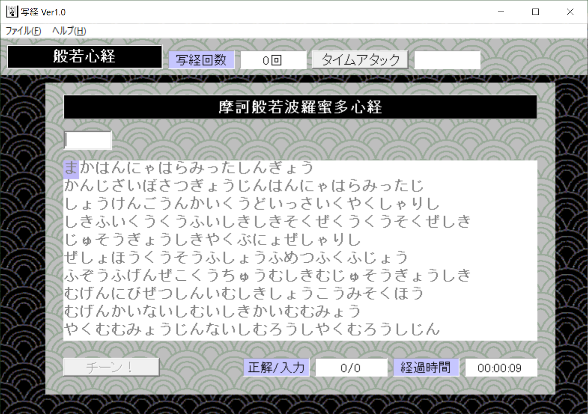

# 写経
  
般若心経を写経するWindowsソフトです。
ソースコードは消失してしまいました。

# 開発の動機など
2000年頃に、人材派遣会社での採用時に行う日本語スキルテストのシステムを作成しました。   
これはそのノウハウを利用して一からスクラッチした写経するソフトです。

# インストール
hannya.exeを、「リンク先を名前をつけて保存」してください。

# 使い方
心ゆくまで写経してください。　
IMEをフックする方式にしてあるでの、ローマ字の入力方式に依存する事なく入力できます。　

  
